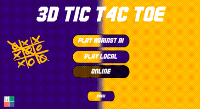

<!-- Title banner opcional -->

  

  
  
  
  
  

<h1 align="center">3D Tic-Tac-Toe (4×4×4) — Jogo Educacional com IA Generativa</h1>

  <b>Protótipo de jogo 3D 4×4×4 criado com suporte do ChatGPT (GPT‑4) para investigar limites de prompting, coautoria humano‑IA e aprendizagem.</b> 
  Stack: Unity • C# • Git/GitHub • (opcional) Netcode/Photon

  <a href="#-visão-geral">Visão Geral</a> •
  <a href="#-recursos">Recursos</a> •
  <a href="#-stack-técnica">Stack</a> •
  <a href="#-como-rodar">Como Rodar</a> •
  <a href="#-controles">Controles</a> •
  <a href="#-metodologia">Metodologia</a> •
  <a href="#-desafios">Desafios</a> •
  <a href="#-resultados">Resultados</a> •
  <a href="#-demo">Demo</a> •
  <a href="#-estrutura-do-repo">Estrutura</a> •
  <a href="#-roadmap">Roadmap</a> •
  <a href="#-licença">Licença</a>

---

## 🚀 Visão Geral
Este repositório reúne um **jogo 3D de Jogo da Velha (4×4×4)** criado com suporte de **IA generativa**. 
**Objetivo original do trabalho:** desenvolver o jogo **100% via ChatGPT**, para **explorar limites, capacidades e boas práticas de prompts** da ferramenta, entendendo quando a IA acerta, erra e como iterar até uma solução estável. 
A execução utilizou **ChatGPT (GPT‑4)** como agente colaborador de programação, com mínima intervenção humana, e discute impactos no **pensamento computacional** e na **aprendizagem** (BNCC/TPACK).

> **Transparência:** onde a IA gerou código incompleto/bugado, os trechos foram **corrigidos** e depois **realimentados** à própria IA, registrando limites e lições de prompting.

---

## ✨ Recursos
- 🎮 **Modos**: humano vs IA, local multiplayer (2–4 jogadores); plano para **online**.
- 🧠 **IA adversária**: heurística de pontuação por linhas/colunas/diagonais no cubo 4×4×4; níveis *fácil/normal/difícil*.
- 🧭 **Interação 3D**: orbitar o cubo, escolher **camada** para jogada; **timer** por jogada (20s).
- 🧩 **UI**: tela de seleção de quantidade de AIs e **dificuldade**; botão **Reset** para posição inicial do cubo.
- 🧪 **Pesquisa educacional**: metodologia de prompting estruturada; análise de aprendizagem e de interação humano‑IA.

---

## 🧱 Stack Técnica
- **Engine:** Unity (2021.3.45f1)
- **Linguagem:** C#
- **IA generativa:** ChatGPT (GPT‑4)
- **Controle de versão:** Git/GitHub
- **Plataformas:** Windows / Mac / Linux

---
## Lista de Funcionalidades

| **Nome**                          | **Descrição** |
|----------------------------------|---------------|
| Gameplay “Tic-Tac-Toe”           | Jogo da velha clássico em grade 3×3, com vitória por três em linha (horizontal, vertical ou diagonal) e detecção de empate. |
| Modos de Jogo                    | **1 Jogador (vs CPU)** e **2 Jogadores (local)**, alternância automática de turnos (X/O). |
| IA do Oponente                   | CPU com estratégia **ótima (Minimax)** ou **heurística** em níveis **Fácil / Médio / Difícil** (configurável). |
| Detecção de Vitória/Empate       | Checagem instantânea a cada jogada; **realce** da sequência vencedora quando houver vitória. |
| Controles e Acessibilidade       | Mouse e teclado (setas/Enter/Esc); foco visível; impede jogada em célula ocupada. |
| Reinício Rápido                  | Botão **Reiniciar** para começar uma nova partida mantendo (ou não) o placar, conforme ajuste. |
| Placar de Partidas               | Contador de vitórias de X, vitórias de O e empates; exibição no HUD. |
| Persistência (Opcional)          | **Salva** e **carrega** o placar em arquivo local (ex.: JSON) entre sessões. |
| Timer por Turno (Opcional)       | Tempo limite configurável; ao estourar, a vez passa para o outro jogador. |
| Feedbacks de UI                  | Sons/efeitos visuais ao jogar, vencer ou empatar (ativar/desativar nas opções). |
| Temas Visuais                    | Tema **claro/escuro** e/ou paletas customizáveis (alto contraste). |
| Logs/Debug (Opcional)            | Console/log simples para depurar IA e estados de jogo durante o desenvolvimento. |

---

## 🎮 Controles
| Ação                     | Tecla(s)                   |
|-------------------------|----------------------------|
| Orbitar câmera          | Mouse                      |
| Selecionar camada       | UI lateral                 |
| Confirmar jogada        | Clique / Botão da UI       |
| Reset posição da câmera | Botão **Reset**            |
| Tempo por jogada        | 20s (pode ser ajustado)    |

---

## 🧭 Metodologia
**Setup do experimento:** todo o ciclo foi conduzido com **ChatGPT (GPT‑4)** visando **gerar 100% do código** e artefatos via IA, com o humano atuando em: execução local, logs, depuração e decisões de design. O foco foi **aprender limites** e **estratégias de prompting** (clareza, decomposição, iteração, fornecer erros à IA, e reset de contexto quando necessário).

**Fluxo de prompting em 6 passos**
1. (Opcional) limpar contexto anterior  
2. Atribuir **papel** (ex.: “programador sênior C#/Unity”)  
3. Detalhar **objetivos e restrições** sem ambiguidade  
4. Pedir **perguntas de esclarecimento** antes da resposta  
5. Exigir **resposta em passos** (código + explicação)  
6. **Iterar** com logs/erros e diffs até atender ao critério de pronto

---

## ⚠️ Desafios
- **Código com erros/omissões** da IA → mitigado com **logs detalhados** e **prompts focados**.  
- **Ferramentas/operacional (Unity)** → ajustes de projeto, dependências e configurações.  
- **Contexto longo** (esquecimento/confusão da IA) → **segmentar tarefas** e reiniciar threads quando necessário.

---

## 📊 Resultados
- A IA **quase** completou o jogo; a **intervenção humana** foi essencial para heurística, checagens de vitória e UX.  
- Estudantes ampliaram **C#**, **Unity**, **engenharia de prompts** e **pensamento computacional**.  
- Alinhamento com **BNCC/TPACK** e referências clássicas (Papert, Piaget, Vygotsky).

---

## 🎥 Demo
<!-- YouTube é a forma mais profissional. Suba o vídeo e atualize o link abaixo. -->

  

---

---

## 🗺️ Roadmap
- [ ] Multiplayer online (Netcode/Relay/Photon)  
- [ ] IA com minimax + poda alfa‑beta  
- [ ] Testes automatizados (PlayMode/EditMode)  
- [ ] Localização (pt‑BR/en)  
- [ ] Acessibilidade (alto contraste, navegação por teclado)

---

## 👥 Autores
- **Você** — desenvolvimento e condução do experimento (prompting com GPT‑4)  
- (Opcional) Demais colaboradores/orientadores

---

## 📜 Licença
Este projeto é licenciado sob **MIT** — veja [LICENSE](LICENSE).
